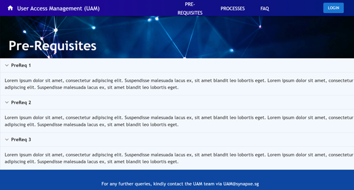

# UAM Front
Landing page frontend application built in React that provides access to Synapxe Singapore's User Access Matrix backend application.

## Visualization
### Homepage 

# Pre-Requisites

# Processes

# FAQ

# Error page

